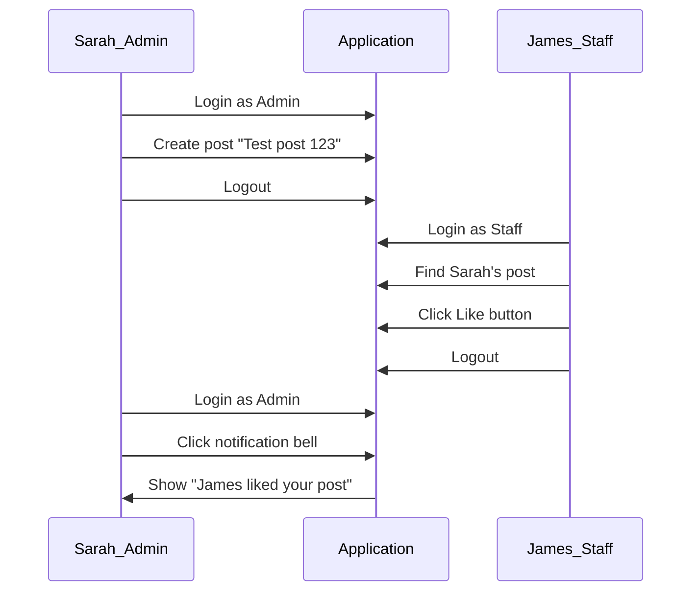

# Cross-User Notification Verification Test

## The Problem

Current tests don't verify that notifications actually reach the intended recipient. We need to:

1. Login as User A (Sarah), create a post
2. Login as User B (James), like/comment on that post  
3. Login back as User A, open notification dropdown
4. **Verify notification about James's action actually appears**

## Test Flow



## Implementation Plan

### Step 1: Create new test file

Create [`tests/e2e/cross-user-notifications.spec.ts`](tests/e2e/cross-user-notifications.spec.ts) with:

### Step 2: Test structure

```typescript
test('User B liking User A post creates notification for User A', async ({ browser }) => {
  // Context A - Sarah creates post
  const contextA = await browser.newContext();
  const pageA = await contextA.newPage();
  // Login as Admin (Sarah)
  // Create a uniquely identifiable post
  // Note the post content for later identification
  await contextA.close();
  
  // Context B - James likes the post  
  const contextB = await browser.newContext();
  const pageB = await contextB.newPage();
  // Login as Staff (James) - select from dropdown
  // Find Sarah's post by content
  // Click the like button
  // Wait for like to register
  await contextB.close();
  
  // Context C - Sarah checks notifications
  const contextC = await browser.newContext();
  const pageC = await contextC.newPage();
  // Login as Admin (Sarah) again
  // Click notification bell
  // ASSERT: notification contains "liked" and relates to the post
  // Take screenshot as evidence
});
```

### Step 3: Key selectors to use

Based on codebase analysis:

- Login dropdown: `select, [role="combobox"]` then select Staff option
- Dev Login button: `button:has-text("Dev Login")`
- Post composer: `textarea[placeholder*="Share"]`
- Post button: `button:has-text("Post")`
- Like button: `button:has(svg.lucide-heart)`
- Notification bell: `button:has(svg.lucide-bell)`
- Notification content: Look for text containing "liked"

### Step 4: Additional tests to add

1. **Comment notification**: James comments on Sarah's post, Sarah sees "commented on your post"
2. **Mention notification**: James mentions @Sarah in a post, Sarah sees "mentioned you"

### Step 5: Screenshot evidence

Each test will capture screenshots at key moments:

- `sarah-creates-post.png`
- `james-likes-post.png`  
- `sarah-notification-received.png`

## Files to Create/Modify

- Create: [`tests/e2e/cross-user-notifications.spec.ts`](tests/e2e/cross-user-notifications.spec.ts) - New comprehensive cross-user test

## Success Criteria

Test PASSES only if:

1. Sarah's notification dropdown shows a notification
2. The notification text contains "liked" or similar
3. The notification relates to the specific post created in the test